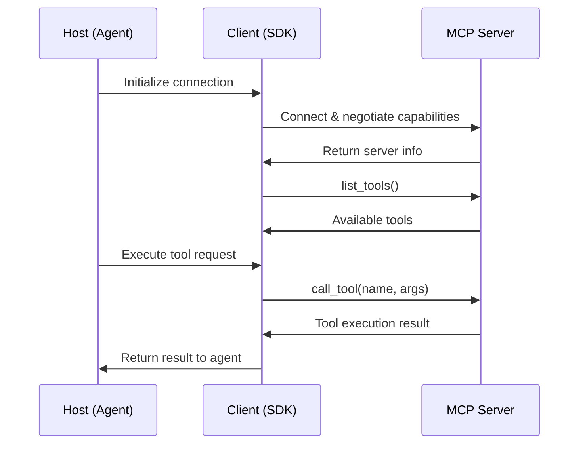

# OpenAI MCP Connection Requirements: Complete Technical Report

## Executive Summary

This report provides a comprehensive analysis of OpenAI's Model Context Protocol (MCP) implementation requirements, based on extensive research of their official documentation, SDK implementations, and technical specifications. OpenAI has adopted MCP as a standardized way to connect AI agents to external tools and data sources, treating it as the "USB-C port for AI applications."

## Table of Contents

1. [OpenAI's MCP Philosophy and Requirements](#openais-mcp-philosophy-and-requirements)
2. [Three Core MCP Server Types](#three-core-mcp-server-types)
3. [Connection Architecture Patterns](#connection-architecture-patterns)
4. [Same-Monorepo MCP Integration](#same-monorepo-mcp-integration)
5. [Separate-Server MCP Integration](#separate-server-mcp-integration)
6. [Technical Implementation Requirements](#technical-implementation-requirements)
7. [Code Examples and Patterns](#code-examples-and-patterns)
8. [Error Handling and Best Practices](#error-handling-and-best-practices)
9. [Performance and Caching Considerations](#performance-and-caching-considerations)
10. [Security and Authentication](#security-and-authentication)

---

## OpenAI's MCP Philosophy and Requirements

### Core Philosophy
OpenAI treats MCP as the **universal connector for AI applications**, similar to how USB-C serves as a universal port for hardware devices. This standardization allows:

- **Plug-and-play tool integration**: Add new capabilities without custom code
- **Interoperability**: Tools from different vendors work seamlessly together
- **Future-proofing**: New tools can be added without major architectural changes

### Key Requirements OpenAI Enforces

1. **JSON-RPC 2.0 Protocol Compliance**: All MCP communications must use JSON-RPC 2.0
2. **Stateful Connection Management**: Servers must maintain session state
3. **Tool Discovery Protocol**: Dynamic `list_tools()` capability
4. **Error Handling Standards**: Consistent error response formats
5. **Transport Layer Support**: Must support at least one of the three official transports

---

## Three Core MCP Server Types

OpenAI's SDK supports exactly three MCP server types, each with specific use cases and technical requirements:

### 1. Hosted MCP Tools
**Purpose**: Remote servers used directly by OpenAI's Responses API
**Technical Requirements**:
- Must be publicly accessible via HTTPS
- OpenAI's servers invoke tools directly
- Results streamed back to the model in real-time

**When to Use**:
- Publicly accessible remote servers
- Default OpenAI Responses models
- Want OpenAI to handle the tool execution

**Implementation Pattern**:
```typescript
import { Agent, hostedMcpTool } from '@openai/agents';

export const agent = new Agent({
  name: 'MCP Assistant',
  instructions: 'Use MCP tools to answer questions.',
  tools: [
    hostedMcpTool({
      serverLabel: 'my-server',
      serverUrl: 'https://api.example.com/mcp',
    }),
  ],
});
```

### 2. Streamable HTTP MCP Servers
**Purpose**: Local or remote servers using Streamable HTTP transport
**Technical Requirements**:
- HTTP endpoint supporting bidirectional messaging
- Real-time streaming capabilities
- Session management

**When to Use**:
- Local development servers
- Remote servers with local tool execution
- Non-OpenAI model integrations
- Need control over tool execution

**Implementation Pattern**:
```typescript
import { Agent, MCPServerStreamableHttp } from '@openai/agents';

const mcpServer = new MCPServerStreamableHttp({
  url: 'https://api.example.com/mcp',
  name: 'My MCP Server',
});

await mcpServer.connect();
```

### 3. Stdio MCP Servers
**Purpose**: Local servers accessed via standard input/output
**Technical Requirements**:
- Process spawning capability
- stdin/stdout communication
- Local execution environment

**When to Use**:
- Local-only tools
- Command-line integrations
- Simple subprocess-based tools

**Implementation Pattern**:
```typescript
import { Agent, MCPServerStdio } from '@openai/agents';

const mcpServer = new MCPServerStdio({
  name: 'Local MCP Server',
  fullCommand: 'npx @modelcontextprotocol/server-filesystem ./data',
});

await mcpServer.connect();
```

---

## Connection Architecture Patterns

### OpenAI's Required Architecture Components

1. **Host**: The main AI application (OpenAI Agent)
2. **Client**: Connector within the host (managed by OpenAI SDK)
3. **Server**: External service providing tools/context

### Communication Flow Requirements



---

## Same-Monorepo MCP Integration

### Architecture Pattern
When both the agent and MCP server exist in the same codebase, OpenAI recommends the **stdio transport** for optimal performance and simplicity.

### Required Directory Structure
```
my-project/
├── src/
│   ├── agent/
│   │   └── main.ts           # OpenAI Agent implementation
│   ├── mcp-server/
│   │   └── server.ts         # MCP server implementation
│   └── shared/
│       └── types.ts          # Shared type definitions
├── package.json
└── tsconfig.json
```

### Implementation Requirements

#### 1. MCP Server Setup (server.ts)
```typescript
#!/usr/bin/env node
import { Server } from '@modelcontextprotocol/sdk/server/index.js';
import { StdioServerTransport } from '@modelcontextprotocol/sdk/server/stdio.js';

const server = new Server(
  {
    name: 'my-local-server',
    version: '1.0.0',
  },
  {
    capabilities: {
      tools: {},
    },
  }
);

// Register tools
server.setRequestHandler('tools/list', async () => ({
  tools: [
    {
      name: 'calculate',
      description: 'Perform mathematical calculations',
      inputSchema: {
        type: 'object',
        properties: {
          expression: { type: 'string' }
        },
        required: ['expression']
      }
    }
  ]
}));

server.setRequestHandler('tools/call', async (request) => {
  const { name, arguments: args } = request.params;
  
  if (name === 'calculate') {
    // Tool implementation
    const result = eval(args.expression); // Note: Use safe-eval in production
    return {
      content: [{ type: 'text', text: `Result: ${result}` }]
    };
  }
  
  throw new Error(`Unknown tool: ${name}`);
});

const transport = new StdioServerTransport();
server.connect(transport);
```

#### 2. Agent Integration (main.ts)
```typescript
import { Agent, run, MCPServerStdio } from '@openai/agents';
import * as path from 'node:path';

async function main() {
  const serverPath = path.join(__dirname, '../mcp-server/server.ts');
  
  const mcpServer = new MCPServerStdio({
    name: 'Local Calculator Server',
    fullCommand: `npx tsx ${serverPath}`,
  });

  const agent = new Agent({
    name: 'Calculator Agent',
    instructions: 'Use the calculator tool to solve math problems.',
    mcpServers: [mcpServer],
  });

  try {
    await mcpServer.connect();
    const result = await run(agent, 'What is 15 * 23?');
    console.log(result.finalOutput);
  } finally {
    await mcpServer.close();
  }
}

main().catch(console.error);
```

#### 3. Package.json Requirements
```json
{
  "name": "my-mcp-project",
  "scripts": {
    "start": "npx tsx src/agent/main.ts",
    "dev:server": "npx tsx src/mcp-server/server.ts",
    "dev:agent": "npx tsx src/agent/main.ts"
  },
  "dependencies": {
    "@openai/agents": "latest",
    "@modelcontextprotocol/sdk": "latest",
    "tsx": "latest"
  }
}
```

---

## Separate-Server MCP Integration

### Architecture Pattern
When connecting to external MCP servers, OpenAI supports both **Streamable HTTP** and **SSE** transports, depending on the server's capabilities.

### Remote Server Connection Requirements

#### 1. Streamable HTTP Connection
```typescript
import { Agent, run, MCPServerStreamableHttp } from '@openai/agents';

async function connectToRemoteServer() {
  const mcpServer = new MCPServerStreamableHttp({
    url: 'https://api.external-service.com/mcp',
    name: 'External Service MCP',
    // Optional authentication
    headers: {
      'Authorization': 'Bearer your-api-key',
      'X-API-Version': '2024-01'
    },
    timeout: 30000, // 30 second timeout
    reconnectionOptions: {
      maxAttempts: 5,
      initialDelayMs: 1000,
      maxDelayMs: 10000
    }
  });

  const agent = new Agent({
    name: 'Remote Integration Agent',
    instructions: 'Use remote tools to fulfill requests.',
    mcpServers: [mcpServer],
  });

  try {
    await mcpServer.connect();
    
    // Enable tool caching for better performance
    mcpServer.cacheToolsList = true;
    
    const result = await run(agent, 'Execute remote operation X');
    return result.finalOutput;
  } finally {
    await mcpServer.close();
  }
}
```

#### 2. SSE Connection (Legacy Support)
```typescript
import { Agent, MCPServerSse } from '@openai/agents';

const sseServer = new MCPServerSse({
  params: {
    url: 'https://api.legacy-service.com/sse',
    headers: {
      'Authorization': 'Bearer api-key'
    },
    timeout: 5, // seconds
    sse_read_timeout: 300 // 5 minutes
  },
  name: 'Legacy SSE Server',
  cache_tools_list: true
});
```

### Multiple Server Integration
```typescript
import { Agent, run, MCPServerStreamableHttp, MCPServerStdio } from '@openai/agents';

async function multiServerAgent() {
  // Local filesystem server
  const localServer = new MCPServerStdio({
    name: 'Filesystem',
    fullCommand: 'npx @modelcontextprotocol/server-filesystem ./workspace'
  });

  // Remote API server
  const remoteServer = new MCPServerStreamableHttp({
    url: 'https://api.service.com/mcp',
    name: 'Remote API'
  });

  const agent = new Agent({
    name: 'Multi-Server Agent',
    instructions: 'Use local and remote tools as needed.',
    mcpServers: [localServer, remoteServer],
  });

  try {
    await Promise.all([
      localServer.connect(),
      remoteServer.connect()
    ]);

    const result = await run(agent, 'Analyze local files and send summary to remote API');
    return result.finalOutput;
  } finally {
    await Promise.all([
      localServer.close(),
      remoteServer.close()
    ]);
  }
}
```

---

## Technical Implementation Requirements

### 1. Connection Lifecycle Management

**Required Methods**:
```typescript
interface MCPServer {
  name: string;
  connect(): Promise<void>;
  cleanup(): Promise<void>;
  list_tools(): Promise<Tool[]>;
  call_tool(tool_name: string, arguments: Record<string, any>): Promise<CallToolResult>;
  invalidate_tools_cache?(): void;
}
```

**Connection States**:
- **Disconnected**: Initial state
- **Connecting**: Connection in progress
- **Connected**: Ready for tool operations
- **Error**: Connection failed
- **Cleanup**: Graceful shutdown

### 2. Error Handling Requirements

**Standard Error Response Format**:
```typescript
interface MCPError {
  code: number;
  message: string;
  data?: any;
}

// Required error codes
const MCP_ERROR_CODES = {
  PARSE_ERROR: -32700,
  INVALID_REQUEST: -32600,
  METHOD_NOT_FOUND: -32601,
  INVALID_PARAMS: -32602,
  INTERNAL_ERROR: -32603,
  SERVER_ERROR_START: -32099,
  SERVER_ERROR_END: -32000
};
```

### 3. Tool Discovery Protocol

**Required list_tools Response**:
```typescript
interface ToolListResponse {
  tools: Array<{
    name: string;
    description: string;
    inputSchema: JSONSchema;
  }>;
}
```

**Required call_tool Request**:
```typescript
interface ToolCallRequest {
  name: string;
  arguments: Record<string, any>;
}

interface ToolCallResponse {
  content: Array<{
    type: 'text' | 'image' | 'resource';
    text?: string;
    data?: string;
    mimeType?: string;
  }>;
  isError?: boolean;
}
```

---

## Code Examples and Patterns

### Human-in-the-Loop Pattern
```typescript
import { Agent, run, hostedMcpTool, RunToolApprovalItem } from '@openai/agents';
import * as readline from 'node:readline/promises';

const agent = new Agent({
  name: 'Supervised Agent',
  instructions: 'Use tools with human approval.',
  tools: [
    hostedMcpTool({
      serverLabel: 'sensitive-operations',
      serverUrl: 'https://api.example.com/mcp',
      requireApproval: {
        always: {
          toolNames: ['delete_file', 'send_email', 'make_payment']
        },
        never: {
          toolNames: ['read_file', 'search', 'calculate']
        }
      }
    }),
  ],
});

async function runWithApproval() {
  let result = await run(agent, 'Process the user request');
  
  while (result.interruptions?.length) {
    for (const interruption of result.interruptions) {
      const approval = await getHumanApproval(interruption);
      
      if (approval) {
        result.state.approve(interruption);
      } else {
        result.state.reject(interruption);
      }
    }
    
    result = await run(agent, result.state);
  }
  
  return result.finalOutput;
}

async function getHumanApproval(item: RunToolApprovalItem): Promise<boolean> {
  const rl = readline.createInterface({ 
    input: process.stdin, 
    output: process.stdout 
  });
  
  const toolName = item.rawItem.name;
  const params = JSON.stringify(item.rawItem.providerData?.arguments, null, 2);
  
  const answer = await rl.question(
    `\nApprove tool execution?\nTool: ${toolName}\nParams: ${params}\n(y/n): `
  );
  
  rl.close();
  return answer.toLowerCase().trim() === 'y';
}
```

### Streaming Integration Pattern
```typescript
import { Agent, run } from '@openai/agents';

async function streamingMCPExample() {
  const result = await run(
    agent,
    'Process this large dataset',
    { stream: true }
  );

  for await (const event of result) {
    if (event.type === 'raw_model_stream_event') {
      if (event.data.event.type === 'response.mcp_call_arguments.delta') {
        console.log('MCP tool arguments streaming:', event.data.event.delta);
      }
      
      if (event.data.event.type === 'response.output_text.delta') {
        console.log('Output streaming:', event.data.event.delta);
      }
    }
  }

  console.log('Final result:', result.finalOutput);
}
```

### Tool Prefix Pattern (Avoiding Conflicts)
```typescript
// When multiple servers have overlapping tool names
const weatherServer = new MCPServerStreamableHttp({
  url: 'https://weather-api.com/mcp',
  name: 'Weather Service',
  toolPrefix: 'weather' // Tools become 'weather_get_forecast', etc.
});

const newsServer = new MCPServerStreamableHttp({
  url: 'https://news-api.com/mcp',
  name: 'News Service', 
  toolPrefix: 'news' // Tools become 'news_get_headlines', etc.
});

const agent = new Agent({
  name: 'Multi-Service Agent',
  mcpServers: [weatherServer, newsServer],
});
```

---

## Error Handling and Best Practices

### Required Error Handling Patterns

#### 1. Connection Error Handling
```typescript
async function robustMCPConnection(serverConfig: MCPServerConfig) {
  const maxRetries = 3;
  let attempt = 0;

  while (attempt < maxRetries) {
    try {
      await mcpServer.connect();
      console.log('MCP server connected successfully');
      return;
    } catch (error) {
      attempt++;
      console.error(`Connection attempt ${attempt} failed:`, error);
      
      if (attempt >= maxRetries) {
        throw new Error(`Failed to connect after ${maxRetries} attempts: ${error}`);
      }
      
      // Exponential backoff
      await new Promise(resolve => setTimeout(resolve, Math.pow(2, attempt) * 1000));
    }
  }
}
```

#### 2. Tool Execution Error Handling
```typescript
async function safeToolExecution(agent: Agent, request: string) {
  try {
    const result = await run(agent, request);
    return result.finalOutput;
  } catch (error) {
    if (error instanceof MCPError) {
      switch (error.code) {
        case MCP_ERROR_CODES.METHOD_NOT_FOUND:
          return "The requested tool is not available.";
        case MCP_ERROR_CODES.INVALID_PARAMS:
          return "Invalid parameters provided to the tool.";
        case MCP_ERROR_CODES.INTERNAL_ERROR:
          console.error('MCP server internal error:', error);
          return "An internal server error occurred.";
        default:
          console.error('Unknown MCP error:', error);
          return "An unexpected error occurred.";
      }
    }
    
    throw error; // Re-throw non-MCP errors
  }
}
```

### Required Cleanup Patterns
```typescript
class MCPAgentManager {
  private servers: MCPServer[] = [];
  private isShuttingDown = false;

  async addServer(server: MCPServer) {
    await server.connect();
    this.servers.push(server);
  }

  async shutdown() {
    if (this.isShuttingDown) return;
    this.isShuttingDown = true;

    console.log('Shutting down MCP servers...');
    
    const cleanupPromises = this.servers.map(async (server) => {
      try {
        await server.cleanup();
        console.log(`Server ${server.name} cleaned up successfully`);
      } catch (error) {
        console.error(`Error cleaning up server ${server.name}:`, error);
      }
    });

    await Promise.allSettled(cleanupPromises);
    this.servers = [];
  }
}

// Graceful shutdown handling
process.on('SIGINT', () => {
  mcpManager.shutdown().then(() => process.exit(0));
});

process.on('SIGTERM', () => {
  mcpManager.shutdown().then(() => process.exit(0));
});
```

---

## Performance and Caching Considerations

### Tool List Caching
```typescript
const mcpServer = new MCPServerStreamableHttp({
  url: 'https://api.example.com/mcp',
  name: 'Cached Server',
  cacheToolsList: true, // Enable caching
  cacheTimeout: 300000, // 5 minutes
});

// Manual cache invalidation when needed
await mcpServer.invalidateToolsCache();
```

### Connection Pooling Pattern
```typescript
class MCPConnectionPool {
  private connections = new Map<string, MCPServer>();
  private maxConnections = 10;

  async getConnection(url: string): Promise<MCPServer> {
    if (this.connections.has(url)) {
      return this.connections.get(url)!;
    }

    if (this.connections.size >= this.maxConnections) {
      // Implement LRU eviction
      const oldestUrl = this.connections.keys().next().value;
      const oldServer = this.connections.get(oldestUrl)!;
      await oldServer.cleanup();
      this.connections.delete(oldestUrl);
    }

    const server = new MCPServerStreamableHttp({
      url,
      name: `Pool-${url}`,
      cacheToolsList: true
    });

    await server.connect();
    this.connections.set(url, server);
    return server;
  }
}
```

### Performance Monitoring
```typescript
class MCPPerformanceMonitor {
  private metrics = new Map<string, {
    calls: number;
    totalTime: number;
    errors: number;
  }>();

  async monitoredToolCall(
    server: MCPServer,
    toolName: string,
    args: any
  ): Promise<any> {
    const startTime = Date.now();
    const key = `${server.name}:${toolName}`;
    
    try {
      const result = await server.call_tool(toolName, args);
      
      // Update metrics
      const metric = this.metrics.get(key) || { calls: 0, totalTime: 0, errors: 0 };
      metric.calls++;
      metric.totalTime += Date.now() - startTime;
      this.metrics.set(key, metric);
      
      return result;
    } catch (error) {
      // Update error metrics
      const metric = this.metrics.get(key) || { calls: 0, totalTime: 0, errors: 0 };
      metric.errors++;
      this.metrics.set(key, metric);
      
      throw error;
    }
  }

  getMetrics() {
    const report = Array.from(this.metrics.entries()).map(([key, metric]) => ({
      tool: key,
      avgResponseTime: metric.totalTime / metric.calls,
      errorRate: metric.errors / metric.calls,
      totalCalls: metric.calls
    }));

    return report.sort((a, b) => b.avgResponseTime - a.avgResponseTime);
  }
}
```

---

## Security and Authentication

### Required Security Patterns

#### 1. API Key Management
```typescript
interface SecureServerConfig {
  url: string;
  apiKey: string;
  validateSSL?: boolean;
  allowedOrigins?: string[];
}

function createSecureServer(config: SecureServerConfig): MCPServerStreamableHttp {
  return new MCPServerStreamableHttp({
    url: config.url,
    name: 'Secure Server',
    headers: {
      'Authorization': `Bearer ${config.apiKey}`,
      'X-Client-Version': '1.0.0',
      'User-Agent': 'OpenAI-Agents-SDK'
    },
    requestInit: {
      // Additional security headers
      headers: {
        'X-Requested-With': 'XMLHttpRequest'
      }
    }
  });
}
```

#### 2. Input Validation
```typescript
function validateToolArguments(toolName: string, args: any): boolean {
  const schemas = {
    'file_operations': {
      path: { type: 'string', pattern: '^[a-zA-Z0-9/._ -]+$' },
      content: { type: 'string', maxLength: 10000 }
    },
    'api_call': {
      url: { type: 'string', pattern: '^https://.+' },
      method: { type: 'string', enum: ['GET', 'POST', 'PUT', 'DELETE'] }
    }
  };

  const schema = schemas[toolName];
  if (!schema) return false;

  // Implement JSON schema validation
  return validateAgainstSchema(args, schema);
}
```

#### 3. Rate Limiting
```typescript
class MCPRateLimiter {
  private limits = new Map<string, {
    count: number;
    resetTime: number;
    maxRequests: number;
    windowMs: number;
  }>();

  async checkLimit(serverId: string): Promise<boolean> {
    const now = Date.now();
    const limit = this.limits.get(serverId) || {
      count: 0,
      resetTime: now + 60000, // 1 minute window
      maxRequests: 100,
      windowMs: 60000
    };

    if (now > limit.resetTime) {
      limit.count = 0;
      limit.resetTime = now + limit.windowMs;
    }

    if (limit.count >= limit.maxRequests) {
      return false; // Rate limit exceeded
    }

    limit.count++;
    this.limits.set(serverId, limit);
    return true;
  }
}
```

---

## Conclusion

OpenAI's MCP implementation provides a robust, standardized approach to connecting AI agents with external tools and services. The key requirements for successful implementation are:

1. **Follow the three-tier architecture**: Host → Client → Server
2. **Use appropriate transport mechanisms**: Stdio for local, Streamable HTTP for remote
3. **Implement proper error handling and connection management**
4. **Enable caching for performance optimization**
5. **Apply security best practices for authentication and validation**

By following these patterns and requirements, developers can create reliable, scalable MCP integrations that work seamlessly with OpenAI's Agent framework, whether connecting to services in the same monorepo or external servers.

The MCP ecosystem is rapidly expanding, with major AI labs adopting it as the standard for tool integration. Understanding and implementing these requirements correctly ensures compatibility with the broader MCP ecosystem and future-proofs your AI agent implementations.